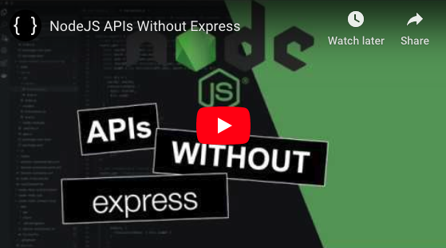

# Simple NodeJS API Server

In this example application, we use the native [HTTP](https://nodejs.org/api/http.html) module for NodeJS to create a simple API server. The server consists of 3 endpoints:

- http://localhost:5000/
- http://localhost:5000/profile
- http://localhost:5000/shipment

Endpoints are configured to serve HTML content or JSON, that's up to your application's needs.

## Tutorial Available

[YouTube: NodeJS APIs without Express](https://www.youtube.com/watch?v=mV2y_3irbKk)

[](https://www.youtube.com/watch?v=mV2y_3irbKk "NodeJS API without Express")

## Running the Server

With [NodeJS](https://nodejs.org/en/) installed, you can started the server by running,

```sh
node app.js
```

_**OR**_

```sh
npm run start
```

## Development

This simple server can be easily extended. After cloning this [repository](https://github.com/brian-childress/node-api-without-express) you can start developing locally.

### Locally (without Docker)

1) Install [Nodemon](https://www.npmjs.com/package/nodemon), Nodemon will watch for file changes and restart the NodeJS process. This allows for faster development and testing.

```sh
npm install -g nodemon
```

2) With Nodemon installed, start the server using Nodemon

```sh
nodemon app.js
```

_**OR**_

```sh
npm run start:dev
```

### Using Docker

I prefer to use Docker for local development wherever possible. This allows me to have a consistent development environment.

#### Start Docker Container

With Docker installed, we can start a container using the latest NodeJS Docker image.

```sh
docker run -it --rm -p 5000:5000 -v $(pwd):/api -w="/api" node bash
```

Start the application in development mode using Nodemon inside your Docker Container

```sh
npm run start:dev
```

To stop your running NodeJS API server

```sh
ctrl + c
```

To quit your Docker Container development environment, in your terminal:

```sh
exit
```

This will cleanup any running containers, (note: the Docker image will still exist on your machine)